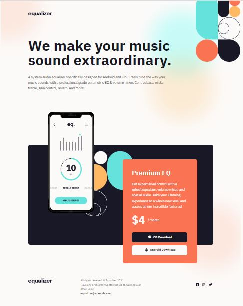
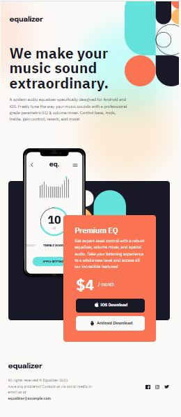

# Frontend Mentor - Equalizer landing page solution

This is a solution to the [Equalizer landing page challenge on Frontend Mentor](https://www.frontendmentor.io/challenges/equalizer-landing-page-7VJ4gp3DE). Frontend Mentor challenges help you improve your coding skills by building realistic projects. 

## Table of contents

- [Overview](#overview)
  - [The challenge](#the-challenge)
  - [Screenshot](#screenshot)
  - [Links](#links)
- [My process](#my-process)
  - [Built with](#built-with)
  - [What I learned](#what-i-learned)
  - [Continued development](#continued-development)
  - [Useful resources](#useful-resources)
- [Author](#author)


## Overview

### The challenge

My challenge was to build out this landing page and get it looking as close to the design as possible.
Users are able to:

- View the optimal layout depending on their device's screen size
- See hover states for interactive elements

### Screenshot

Thiese are screenshots of desktop version of the site: ,
and these are tablet versions: ,
and here are mobile version screenshots: 


### Links

- Solution URL: [https://github.com/Aleqsa123/equalizer]
- Live Site URL: [https://aleqsa123.github.io/equalizer/]

## My process

### Built with

- Semantic HTML5 markup
- CSS custom properties
- Flexbox
- CSS Grid
- Mobile-first workflow


### What I learned

I enhanced my knowledge in backgrounding. Making separate div for background was helpful. I mastered sizing and position of backgrounds.
Making link-buttons with only link tags and padding was also great experience.
In tablet version of the page, it was impossible to activate ios link tab. It was because footer was covering reddiv. So z-index was very helpfil here, and I realised importance of z-index.

```html
  <div class="blackdiv"><div>
```
```css
.bgdiv {
    height: 194.5rem;
    width: 37.5rem;
    background-image: url(./assets/bg-main-mobile.png);
    background-repeat: no-repeat;
    background-size: 58.2rem 78rem;
    background-position: left 5rem top -25rem;
}

    .reddiv {
        position: absolute;
        width: 44.6rem;
        height: 62.5rem;
        top: 95rem;
        left: 73.4rem;
        z-index: 1;
    }
```

### Continued development

It is time using javascript in projects.


### Useful resources

(https://developer.mozilla.org/en-US/) and (https://www.w3schools.com/) - These are amazing sites which helped me in backgrounding.
(https://codepen.io/sosuke/pen/Pjoqqp) - This site generated filter combination, that I used then to fill svg images on hover state of the element.

## Author

- Fronendmentor - [Aleqsa123] (https://www.frontendmentor.io/profile/Aleqsa123)
- Github - [Aleqsa123](https://github.com/Aleqsa123)
- Linkedin - [Aleksi Merebashvili](https://www.linkedin.com/in/aleksi-merebashvili-36627426/)
- Facebook - [Aleksi Merebashvili](https://www.facebook.com/aleksi.merebashvili)
